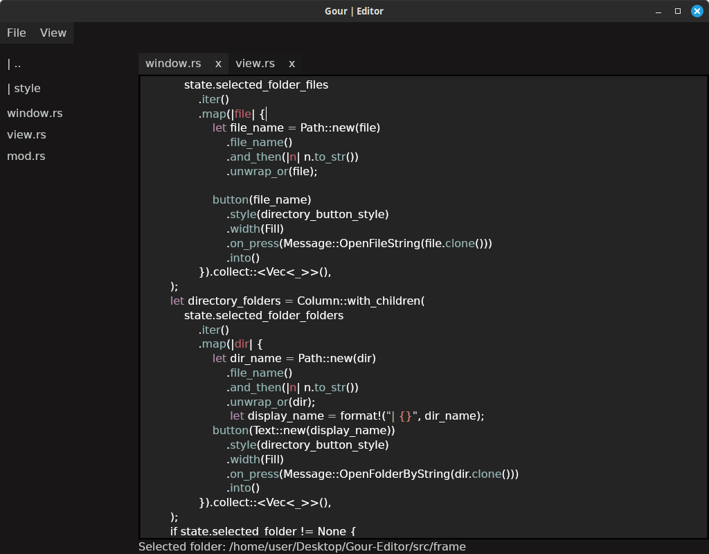

# Gourmet Text Editor (Alpha)

An experimental and modern text editor built with Rust and the [Iced](https://github.com/iced-rs/iced) GUI library.

## Features

- **Directory tree**: Open a directory tree.
- **Modern gui with iced**: Uses Iced for a clean and responsive interface.
- **Cross-platform**: Runs on Windows, macOS, and Linux.
- **Syntax highlighting** (planned feature).
- **Customization options** (planned feature).
- **Finder** (planned feature).




## Installation

### Prerequisites
- Install Rust: [Rust Lang](https://www.rust-lang.org/)
- Ensure you have `cargo` installed.

### Build and Run
```sh
# Clone the repository
git clone https://github.com/ItalianG0urmet/Gour-Editor.git
cd Gour-Editor

# Build the project
cargo build --release

# Run the project
cargo run
```


## Contributing
Contributions are welcome! Feel free to open issues or submit pull requests.

## Acknowledgments
- [Iced](https://github.com/iced-rs/iced) - The GUI framework used in this project.
